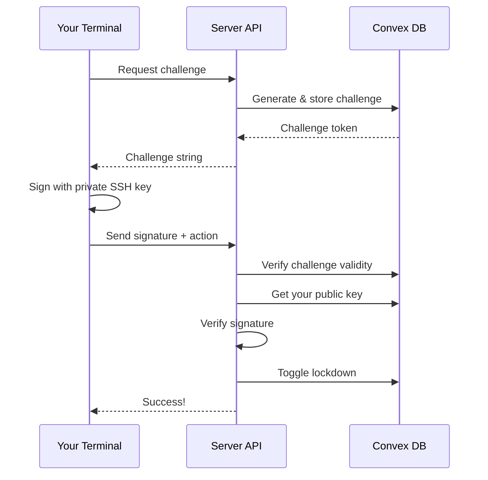

# SSH Key Authenticated Lockdown Toggle

## Overview
Secure emergency lockdown toggle system that can only be triggered from an authorized device using SSH key authentication. Uses challenge-response protocol to verify device identity.

## Security Features
- **SSH Key Authentication**: Only devices with registered private keys can toggle lockdown
- **Challenge-Response Protocol**: Prevents replay attacks with time-limited challenges (5 min expiry)
- **Single-Use Challenges**: Each challenge can only be used once
- **Master Key Protection**: Device registration requires master key
- **Cryptographic Signatures**: Uses SHA-256 signing with RSA/ECDSA/ED25519 keys

## Setup

### 1. Register Your Device
First, register your SSH public key with the system:

```bash
npm run lockdown:register
```

You'll be prompted for:
- Device name (e.g., "Admin Laptop")
- Master key (get from Convex dashboard or initialize with `convex run admin:initializeMasterKey`)

The script will:
- Read your public key from `~/.ssh/id_rsa.pub`
- Display key information (type, size, fingerprint)
- Register the device in Convex DB

### 2. Toggle Lockdown
Once registered, you can toggle lockdown from your terminal:

```bash
# Activate lockdown
npm run lockdown:toggle on

# Deactivate lockdown
npm run lockdown:toggle off
```

## How It Works



### Step-by-Step:
1. **Request Challenge**: CLI requests a random challenge from server
2. **Sign Challenge**: CLI signs challenge with your private SSH key
3. **Verify Signature**: Server verifies signature against your registered public key
4. **Toggle Lockdown**: If valid, server toggles lockdown state in DB
5. **Enforce**: Middleware blocks all requests when lockdown is active

## Configuration

### Custom SSH Key Path
By default, the system uses `~/.ssh/id_rsa` (private) and `~/.ssh/id_rsa.pub` (public).

To use a different key:

```bash
# For registration
SSH_PUBLIC_KEY_PATH=~/.ssh/my_key.pub npm run lockdown:register

# For toggle
SSH_PRIVATE_KEY_PATH=~/.ssh/my_key npm run lockdown:toggle on
```

### Custom API URL
Set the site URL for production:

```bash
NEXT_PUBLIC_SITE_URL=https://yourdomain.com npm run lockdown:toggle on
```

## Database Schema

### authorizedDevices
```typescript
{
  name: string,           // Device name
  publicKey: string,      // SSH public key (OpenSSH format)
  keyType: string,        // "rsa", "ecdsa", or "ed25519"
  fingerprint: string,    // SHA256 fingerprint
  addedBy: string,        // Who registered this device
  addedAt: number         // Timestamp
}
```

### lockdownChallenges
```typescript
{
  challenge: string,      // Random base64 challenge
  createdAt: number,      // Creation timestamp
  expiresAt: number,      // Expiry timestamp (5 min)
  used: boolean           // Whether challenge was used
}
```

## API Endpoints

### POST /api/security/lockdown-challenge
Generates a new challenge for signing.

**Response:**
```json
{
  "challenge": "base64-encoded-random-bytes"
}
```

### POST /api/security/lockdown-toggle
Verifies signature and toggles lockdown.

**Request:**
```json
{
  "challenge": "base64-challenge",
  "signature": "base64-ssh-signature",
  "action": "on" | "off"
}
```

**Response:**
```json
{
  "success": true,
  "message": "Lockdown activated",
  "timestamp": "2026-01-08T13:45:00.000Z"
}
```

## Supported Key Types
- **RSA**: 2048+ bits recommended
- **ECDSA**: nistp256, nistp384, nistp521
- **ED25519**: Modern, recommended

## Troubleshooting

### "Private key not found"
- Check that your SSH key exists at `~/.ssh/id_rsa`
- Or set `SSH_PRIVATE_KEY_PATH` environment variable

### "No authorized device found"
- Run `npm run lockdown:register` first
- Verify device was registered in Convex dashboard

### "Invalid signature"
- Ensure you're using the same key pair (public key registered matches private key used)
- Check that your private key is not encrypted (or provide passphrase)

### "Challenge expired"
- Challenges expire after 5 minutes
- Run the command again to get a fresh challenge

## Security Considerations

✅ **Secure:**
- Private key never leaves your machine
- Challenge-response prevents replay attacks
- Time-limited challenges (5 min expiry)
- Single-use challenges
- Cryptographic signature verification

⚠️ **Important:**
- Keep your private SSH key secure
- Only register trusted devices
- Master key required for device registration
- Lockdown affects all users (use carefully)

## Files Created
- `convex/schema.ts` - Added authorizedDevices and lockdownChallenges tables
- `convex/security.ts` - Added device and challenge management mutations
- `src/app/api/security/lockdown-challenge/route.ts` - Challenge generation endpoint
- `src/app/api/security/lockdown-toggle/route.ts` - Signature verification and toggle endpoint
- `scripts/lockdown-toggle.ts` - CLI tool for toggling lockdown
- `scripts/register-device.ts` - CLI tool for device registration
